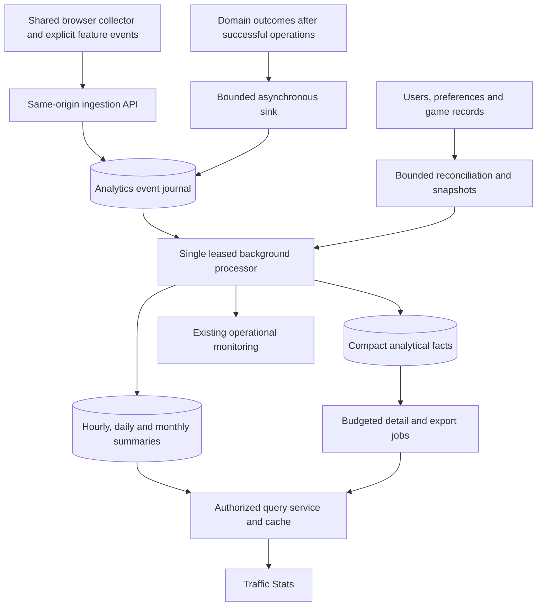

# Traffic Stats proposal

Status: approved for implementation, with the retention amendment below. See [the implementation and operations guide](traffic-stats.md) for the delivered behavior and operational details.

**Approved amendment, 24 September 2026:** retain all accepted analytics data indefinitely, including detailed events, hourly summaries, attempts, and preference history. Do not add TTL indexes or age-based deletion. Derive appearance/audio options from their owning catalogs automatically; analytics must not maintain a second list of options. This amendment supersedes the original retention recommendations.

Prepared 24 September 2026 against the current working checkout and the adjacent deployment workspace. Production traffic, database contents, server capacity, and the authenticated report page were not inspected. The public web fetch of `/report/list` was unsuccessful; navigation findings below come from the controller, routes, and views. Several relevant files have existing local changes, so this proposal describes the working tree rather than assuming that production matches it.

**Recommendation.** Build a first-party product analytics subsystem, owned by a new `traffic` module, with a **Traffic Stats** entry in the existing reporting navigation. Collect a small set of explicit browser observations and server outcomes, turn them into bounded analytical records in the background, and serve charts from precomputed summaries. Reuse MongoDB, Scala/Play, the shared appearance registry, and the existing chart tooling. Keep game execution and matchmaking independent of analytics availability.

The result should answer three questions: **What do people try to do? Where do they succeed or leave? Which changes would most improve their experience?** Every report needs a defined denominator, data source, coverage indicator, and useful follow-up comparison.

## 1. What the investigation established

| Area                   | Evidence in this checkout                                                                                                                                                                                                                                      | Design consequence                                                                                                                                                                                       |
| ---------------------- | -------------------------------------------------------------------------------------------------------------------------------------------------------------------------------------------------------------------------------------------------------------- | -------------------------------------------------------------------------------------------------------------------------------------------------------------------------------------------------------- |
| Reporting              | `app/controllers/Report.scala`, `conf/report.routes`, and `modules/mod/src/main/ui/ModUi.scala` implement moderation reports and their shared menu.                                                                                                            | Add a menu entry and a separate controller/module. Traffic statistics are not a moderation report room.                                                                                                  |
| Operational monitoring | `modules/mon/src/main/mon.scala` already records HTTP, registration, puzzle-attempt, and pool-wave metrics. `modules/web` includes Prometheus and Influx integration.                                                                                          | Retain operational monitoring for service health. It cannot supply the complete journey, preference, and retention model requested here. Actual production metric retention is unverified.               |
| Live presence          | `ui/lib/src/socket.ts` and `doc/homepage-presence.md` describe a shared anonymous browser ID, account deduplication, activity categories, and lila-ws occupancy snapshots.                                                                                     | Reuse relevant identity mechanics through a shared owner. Connected occupancy and measured active visitors must have different labels. Presence snapshots do not reconstruct past visitors or attention. |
| Matchmaking            | `ui/round/src/round.matchmaking.ts` has ready, matching, and handoff phases; `/play/room/:poolId` does not immediately join the queue. `PoolActor`, `PoolApi`, `GameStarter`, and lobby hooks own actual matching.                                             | Instrument entry, start, accepted queue membership, cancellation/disconnection, persisted game, successful handoff, and first move independently. Cover registered pools and anonymous hooks.            |
| Puzzle activity        | `PuzzleComplete` handles ordinary completion; batch paths also exist. `PuzzleRound` is keyed by user and puzzle, stores the first-play date, and updates the result. `Puzzle.UserResult` is emitted for a first recorded result, and feeds activity summaries. | Introduce an attempt identity for new analytics. Neither historical puzzle rounds nor the activity stream is a ledger of all attempts, repeats, and anonymous play.                                      |
| Appearance             | `Appearance.scala` owns the catalog; `PrefApi` owns persistence; `RequestPref` and Dasher determine effective presentation. Missing preference documents resolve to defaults.                                                                                  | Resolve snapshots through existing preference semantics. Count defaults, record rendered choices, and capture changes at their owning layer.                                                             |
| Audio                  | `ui/site/src/sound.ts` keeps music-enabled, effects-enabled, and volume in browser storage. `backgroundMusic.ts` arbitrates playback across tabs.                                                                                                              | A selected music pack does not establish that music is enabled or playing. Audio reports require browser state and playback observations.                                                                |
| Users                  | `UserRepo` contains creation dates, enabled/closed state, profile flags, language, and erasure paths.                                                                                                                                                          | Registration trends and current account totals can use persisted facts. Profile flags and inferred geography require separate reports.                                                                   |
| Geography              | `modules/security/src/main/GeoIP.scala` already supplies cached country, region, and city lookup from a local MaxMind database; an update script exists.                                                                                                       | Reuse local lookup. Verify deployment configuration and freshness; report unknown locations when unavailable.                                                                                            |
| Charts                 | `ui/chart/package.json` already includes Chart.js, time adapters, zoom support, and a range slider.                                                                                                                                                            | Extend the existing chart and theme infrastructure.                                                                                                                                                      |
| Deployment             | Adjacent `push-local-live.ps1` and `push_transport.py` package migrations and manage backup/recovery. The local Compose definition uses MongoDB 8 with a replica set, Redis with AOF, and Caddy. MongoDB's configured WiredTiger cache is 0.5 GB.              | Integrate schema/index setup, backfill, resources, retention, and GeoIP prerequisites into this deployment path. Treat these as local configuration findings, not proof of the current live state.       |

One documentation discrepancy matters: `doc/THEME_PACKS.md` describes compact pack persistence and audio toggles differently from the current implementation. The implementation stores component choices and retains separate browser audio toggles. Update that documentation during implementation; analytics must follow actual preference and audio ownership.

The inherited architecture offers useful lessons: explicit domain events, cached lookups, bounded asynchronous work, indexed derived datasets such as Insight, and operational counters with limited dimensions. Keep these strengths. The in-process event bus and current activity writers do not provide a durable analytics delivery guarantee.

## 2. The report should be organized around decisions

Use `/report/traffic` as the entry point, linked as **Traffic Stats** beside the other report tools. Give it eight internal views. The overview should remain readable without opening every chart.

| View                   | Principal reports                                                                                                                                         | Decisions it supports                                                                                |
| ---------------------- | --------------------------------------------------------------------------------------------------------------------------------------------------------- | ---------------------------------------------------------------------------------------------------- |
| Overview               | Visitors, active minutes, new accounts, puzzle attempts, completed games, matching success, returning users; comparison with a previous equivalent period | Is the site growing, and is that growth producing successful play and learning?                      |
| Acquisition            | Referring domains, search/social/direct-or-unknown sources, allowlisted campaign tags, landing pages, device class, activation and later return by source | Which links or campaigns bring people who actually use the site?                                     |
| Pages and journeys     | Entrances, measured visits, visible time, engaged time, meaningful actions, quick exits, next-page families, selected funnels                             | Which pages help visitors progress, and where do they encounter friction?                            |
| Matchmaking            | Entry-to-start conversion, join failures, accepted searches, pairing and abandonment, wait distributions, handoff failures, no-first-move games           | Is a problem caused by discoverability, the waiting experience, a thin pool, or a technical failure? |
| Puzzles and learning   | Starts, accepted results, success, reveal/give-up, repeats, active solving time, theme selection, lesson-to-practice conversion, notation exercises       | Which teaching content is useful, too hard, hard to find, or technically failing?                    |
| Appearance and audio   | Current saved preferences, active use, adoption and switching, board-piece combinations, audio enabled time and actual playback                           | Which choices are valued, which are tried and abandoned, and which may be failing to load?           |
| Audience and retention | Country/region/city, language, device, registered/anonymous split, account creation, active accounts, activation, D1/D7/D30 return                        | Which audiences need better localization or onboarding, and whether improvements last                |
| Data quality           | Collection coverage, dropped/rejected events, reconciliation discrepancies, processing delay, geography coverage, exclusions, definition changes          | Whether the other reports are trustworthy enough to guide a decision                                 |

Shared controls: custom date range; hour/day/week/month/year grouping where retained resolution supports it; comparison period; registered/anonymous; new/returning; device; language; and relevant source/geography filters. Each view offers its own meaningful dimensions, such as pool or puzzle theme. Users can drill from a chart into a table with counts, percentages, and sample sizes, save filter presets, and export the displayed aggregates as CSV.

Include a small experience-quality panel within Pages and journeys: page-load and interaction latency, layout instability, board/engine readiness, and categorized asset or application failures. Collect a bounded sample of browser performance measurements, with feature detection and visible sample coverage; get application failures from explicit owners with scrubbed error categories. This lets an administrator distinguish an unpopular page from a slow or broken page without collecting arbitrary error payloads or a recording of the visitor's screen.

Keep filters in the URL so a report can be bookmarked or shared with another authorized administrator. Server authorization applies on every request. Tables must provide an accessible alternative to charts. Reuse shared colors, spacing, typography, responsive components, and translations; verify desktop, intermediate widths, and mobile.

Each metric's explanation should show its definition, numerator/denominator, source, freshness, exclusions, and whether it is estimated or incomplete. Show release and content-change annotations. An incomplete current day should compare with the same elapsed portion of the previous period, or clearly use completed periods.

Examples of useful findings, purely illustrative:

- “Notation visitors often start an exercise, but mobile users rarely complete it; error rate also increased after release X.” This suggests inspecting the exercise interaction or a regression.
- “Paper Board is tried by many users, but most switch back before ten active board minutes. Its successful render rate is normal.” Compare readability and selection expectations before retiring it.
- “A campaign brings fewer visitors but more first games and seven-day returners.” This is more informative than ranking sources by pageviews.
- “Pairing succeeds quickly, but users leave during round initialization.” Improving pool matching would address the wrong stage.

Short visits can mean successful reference lookup, and long visits can mean confusion. Report outcomes alongside duration. Preferences and geography show associations; they do not establish causes or reveal age, gender, income, or other uncollected demographics.

## 3. Metric definitions that prevent misleading answers

### Visitors, sessions, and time

Keep **measured browser visitors**, **active registered accounts**, **sessions**, **page visits**, and **connected occupancy** separate. An anonymous browser is not a reliably identified person. Cookie/storage clearing, multiple devices, disabled JavaScript, blocking, and collection choices limit coverage.

A session ends after a proposed 30 minutes without measured activity. A tab gets a page-instance ID; logical page changes get new visit IDs even when HTML is replaced without a full navigation. The matchmaking-to-round handoff is a concrete existing case. Merely switching tabs pauses attention; it does not immediately end the session.

Collect two duration measures:

- **Visible time:** the document is visible. It can include a page left open while its user does something else.
- **Engaged time:** the page is visible and has recent meaningful interaction, using a proposed 120-second idle cutoff. Reading and long calculation can be undercounted, so show visible time alongside it. Active puzzle-solving time additionally requires an unfinished puzzle in solve mode; solution review gets its own activity state.

Use monotonic browser time for elapsed duration. Pause across hidden pages, sleep, and frozen tabs; cap implausible deltas. Pointer/key/scroll events update a local activity timestamp rather than generating network events. Keyboard and touch use must count. Existing socket idle handling is not sufficient by itself for this definition.

One active tab per browser owns the person-time allocation, using shared tab coordination. Reuse the ownership lessons in the existing music code without coupling attention ownership to audio playback. Preserve page-visible observations separately. For registered accounts active on multiple devices, merge overlapping intervals in the background for account-time totals; use a documented most-recent-interaction rule when allocating exclusive account-time to pages. Retain device-minutes as a separately labeled measure. Never silently add overlapping intervals and call the result person-time.

Daily unique counts cannot be added to obtain monthly unique counts. Daily p95 values cannot be averaged into a monthly p95. Store mergeable distinct-count summaries and duration distributions; compute ratios from summed numerators and denominators. Label large-range distinct estimates and their uncertainty. Current saved-preference counts remain exact for their snapshot population.

Use UTC storage and a clearly displayed reporting timezone. Start with UTC plus one configured site reporting timezone, with precomputed calendar buckets for both, including DST. Arbitrary-timezone detailed queries can use retained facts through a bounded export job; they must not relabel UTC daily buckets as local days. Mark missing periods as unavailable rather than zero.

### Matchmaking

The canonical funnel is:

`CTA exposed → CTA clicked → room entered → Start clicked → server accepted search → game persisted → board ready → first move → game completed`

Measure CTA exposure only for selected important controls, using visibility observation; avoid recording every DOM element. Keep placement IDs such as homepage rated card, room action, and time-control tile. Direct room entry has no preceding CTA event and remains a valid entry path.

Every search gets an attempt ID. Repeated websocket join messages and reconnections retain the same attempt while membership remains active. A deliberate new search or pool change creates a new attempt. Server membership acceptance defines the start of **queue wait**; room entry defines **room dwell**; accepted search to usable board defines **experienced wait**.

Terminal reasons include paired, explicit cancellation, changed pool, takeover by another tab, disconnected/expired, join rejected, game creation failed, and interrupted by a server restart. Disconnection is an inferred outcome, with the existing cleanup delay, rather than a claim that the person deliberately abandoned the queue. A game successfully persisted is stronger evidence than a pairing candidate selected by a pool wave.

Show median/p90/p95 wait among paired attempts, plus cancellation-time distributions and pairing within 10/30/60/120 seconds among sufficiently observed attempts. Include ongoing and uncertain attempts separately. A cutoff window must not classify still-waiting users as failures. This avoids presenting excellent waits after excluding everyone who gave up.

Break down by canonical pool/time-control configuration, rated/casual, registered/anonymous, time of day, device, and coarse geography. Pools can incorporate anonymous hooks, so `PoolActor` alone is not the complete owning boundary. Correlate game creation and the browser handoff; the current seamless bootstrap can fail after a game has already been created.

### Puzzles and learning

Define a **puzzle attempt** as a deliberate solve session, normally starting with the first user move, not simply receiving or prefetching a puzzle. Record presented, started, result submitted/accepted, solved, failed/revealed, resumed/repeated, and next-puzzle transitions. A distinct attempt ID survives retries of the same submission; a later replay gets a new ID. Keep correctness and time-to-first-action separate from completion.

“Puzzles played” defaults to started attempts; offer accepted completions, unique puzzles, unique solvers, and rated first attempts as explicit alternatives. Server acceptance confirms processing, not independent proof of human effort or correctness beyond the current puzzle validation rules. Browser starts and server completions have different coverage; funnel reports must disclose unmatched outcomes rather than producing rates above 100%.

Hook ordinary, anonymous, casual, repeat, and supported batch paths consistently. Do not attach the only instrumentation to `Puzzle.UserResult`, because that excludes repeat outcomes and anonymous play. Keep deferred Puzzle Streak/Storm/Racer outside the implementation scope.

Keep the **theme selected by the visitor** separate from **the themes attached to the puzzle**. In the current code, `PuzzleAngle` selects a single theme or mix. Multi-theme puzzle classifications are not evidence of a user selecting that combination. If a future selector supports combinations, record the explicit selection then. Theme overlap reports may count one puzzle in multiple themes, and must say so.

For Learn → Xiangqi Notation, separate the explanatory view from started exercises, mode, timed/untimed sessions, attempts, completion, and repeat use. For puzzle theme lessons, separate browsing/reading, lesson interaction, practice entry, and subsequent solving. Neither a lesson animation nor solution playback counts as time spent solving.

### Accounts, geography, language, and acquisition

Offer new accounts per period, cumulative recorded account creations, currently enabled accounts, closed accounts, and active registered accounts. Creation, confirmation, and first successful activity are separate steps. Show bots/test accounts as explicit exclusions. Closed and erased records may limit historical reconstruction; a backfill is not automatically the total number of accounts ever created.

Offer three country reports: profile flag, inferred geography of measured visits, and signup geography recorded from launch onward. Profile flags are user selections, not verified residence. Geography percentages include an unknown category and state whether their denominator is visitors, sessions, or accounts. Cities use coarse aggregate reporting and minimum sample sizes. IP lookup cannot establish an exact physical address or stable residence; MaxMind documents missing values and the uncertainty of these databases. [MaxMind data documentation](https://dev.maxmind.com/geoip/docs/databases/city-and-country/)

Record the language actually rendered, separately from account language and browser language. Normalize localized routes into the same page family. Keep device class and coarse browser family for usability analysis, with an unknown category.

Capture the external referring domain, landing page family, and allowlisted campaign identifiers at session entry. Retain first-observed and session acquisition separately; internal navigation does not overwrite acquisition. “Direct or unknown” is the honest label for visits without usable attribution. Link acquisition to first puzzle/game/lesson and later return only for the measurable population. Record campaign costs only if supplied; visitor volume alone cannot establish advertising return on spend.

Define activation as a configurable, versioned meaningful outcome: for example, one accepted puzzle completion, one played game, or one completed notation exercise. Show the constituent outcomes so a changing mix cannot conceal a decline in one feature. For D7 retention, the denominator is accounts in the selected signup cohort whose seventh reporting-calendar day has fully elapsed; the numerator is those with measured meaningful activity on that day. Offer rolling-week return as a separately named metric. Unknown collection coverage and erased/unobservable subjects need explicit treatment, rather than automatically becoming nonreturners. Returning anonymous browsers use their first-observed date, which is not necessarily their first-ever visit.

### Appearance and audio

Three views answer different questions:

1. **Saved now:** a daily snapshot of all eligible registered users, including users without preference documents resolved through canonical defaults. Also offer recently active registered users. Count each account once.
2. **Actually used:** measured active minutes with each effective board, piece set, UI theme, and background. Board/piece usage counts time on a surface displaying the relevant board; merely having Paper selected while reading a text page does not establish board use. Separate practice/play boards from small thumbnails and previews.
3. **Adoption and switching:** transitions, active minutes before switching, return to a choice, and use on a later visit. Calendar tenure is a different metric and includes time away from the site. The initial snapshot has unknown prior tenure; it does not begin a fictitious historical adoption episode.

Preserve a short-lived pseudonymous per-account usage history and compact per-account/day totals to answer the requested longitudinal questions. The normal report shows aggregate distributions and cohorts. A named user's full browsing timeline would require a separate product decision; it is unnecessary for these reports.

Store actual component keys at observation time plus catalog/definition version, so changing defaults or catalog names does not rewrite historical usage. Use the canonical server catalog for labels. For Device Theme, retain both requested `system` and the resolved light/dark presentation. Store `custom` for user-supplied backgrounds, not the URL. Quantize board adjustments into a few useful categories instead of grouping by every slider value.

The board × pieces matrix should toggle between account share, active board-minute share, and subsequent return. Offer UI theme × background and the most common complete combinations as additional views. Percentages over current account choices sum to 100%; “users who tried this during a month” can overlap and need not.

For audio, report:

- Last-observed browser toggle states, including unknown and mixed-device states for accounts, with an observation date.
- Percentage of measured active time with music enabled and with effects enabled; the denominator is measured active time with known audio state.
- Effective audio availability: toggle on, nonzero volume, selected pack, and browser playback capability.
- Observed music playback time and blocked/failed playback, obtained from the shared audio owner. Playback still cannot prove that the person's speakers were audible.

An account that has not visited since collection began has no known browser-local audio state. Do not infer it from `Pref.appearance.musicSet`. Account-level audio preference synchronization could be a separate feature; analytics should measure current behavior without silently changing it.

## 4. Architecture and ownership

**Module boundary.** Add `modules/traffic` for collection validation, storage, processing, report definitions, snapshots, retention, and querying. Put the small typed event contract/sink interface in `modules/core` so pool, puzzle, user, and preference owners can publish outcomes without depending on dashboard code. Wire implementations through the existing application environment. Add `app/controllers/Traffic.scala`, traffic views, and a `ui/traffic` reporting package. Keep the shared browser transport and clock under `ui/lib`, initialized through the site bootstrap; feature modules emit explicit semantic events.

**A typed catalog.** Each event has an owner, schema version, allowed properties, identity/deduplication rule, validity checks, and destination reports. Each metric has one definition of numerator, denominator, dimensions, retention, and data authority. Reuse catalog keys for pools, appearance, and puzzle themes. Generate or validate browser/server contracts during the build. Avoid a generic endpoint accepting arbitrary event names or arbitrary property bags.

**Event envelope.** Use event ID, event kind, schema version, received time, bounded observed time, page/session/attempt identifiers as applicable, pseudonymous subject reference, source kind, consent/collection mode, and a strictly bounded payload. Derive authenticated identity and trusted geography on the server. Client-submitted user IDs, result authority, duration, and country are untrusted. Full page URLs, query strings, puzzle positions, private game tokens, chat, form contents, and raw custom background URLs do not belong in analytics records.

**Browser collection.** Accumulate duration locally; send compact batches approximately once per active minute and on important state boundaries. Flush on page visibility change and suitable page lifecycle events, including bfcache restoration and logical route transitions. Ordinary sends use an acknowledged request; `sendBeacon` is a best-effort final flush, not a persistence acknowledgement. Its success return indicates queuing, and lifecycle delivery has limits. [MDN sendBeacon](https://developer.mozilla.org/en-US/docs/Web/API/Navigator/sendBeacon)

Start with a 16 KB batch limit, at most 20 records per batch, a small bounded retry queue, exponential backoff, and a short retry lifetime. Split state changes locally so elapsed time belongs to the state actually in use. Suspend periodic sends when hidden or idle. A page crash may lose its final unsent interval; do not extend its last heartbeat indefinitely. Browser retries retain the original event IDs.

**Identity.** Use one shared browser identity owner, extracting the existing presence identity mechanics as needed. Analytics authorization/opt-out gates its use independently of live presence. Use a purpose-specific keyed pseudonymous account identifier on the server; keep the key outside the database. Maintain an erasable, bounded browser-to-account attribution link for the current session when login occurs. Never merge all past activity on a shared browser into whichever account logs in last. Publish browser-based visitor and account-based active-user counts separately instead of adding them into a purported exact people count.

**Storage choice.** Start with ordinary MongoDB collections in a dedicated analytics database and restricted connection pool. This gives an acknowledged journal, unique event keys, indefinite retention, analytical facts, and materialized results with the existing driver and deployment. MongoDB documents precomputed materialized views; ordinary collections also avoid the unique-index limitations of time-series collections, which matter for event deduplication. [MongoDB materialized views](https://www.mongodb.com/docs/v8.0/core/materialized-views/), [time-series limitations](https://www.mongodb.com/docs/manual/core/timeseries/timeseries-limitations/)

This is logical isolation, not physical CPU, disk, or Mongo cache isolation. The resource limits and load test below are release requirements. Do not add Redis Streams, Kafka, a second analytics database engine, or an external analytics SaaS merely as intermediate transport. MongoDB already supplies the durable journal here. Redis remains available for established application functions.

The alternatives have different roles. Request logs help establish delivery volume and service errors, but cannot measure active use or browser-local preferences. A general analytics product can supply conventional traffic charts, but the domain events and careful matchmaking/puzzle semantics still need implementation and would introduce another data/permission boundary. A dedicated columnar store is attractive for larger analytical workloads, but adds a service before its need is demonstrated. The recommendation is therefore a deliberate fit to LiXiangQi's domain and resource constraints, with the cost of owning the metric definitions and processor acknowledged. It is not a claim that MongoDB is universally the best analytics engine.

**Proposed datasets.**

| Dataset                    | Grain and responsibility                                                                                                          |
| -------------------------- | --------------------------------------------------------------------------------------------------------------------------------- |
| `traffic_event`            | Immutable validated event; unique event key; short-lived replay and debugging source                                              |
| `traffic_visit`            | Page/session facts with timing, acquisition, allowed audience dimensions, and outcomes                                            |
| `traffic_attempt`          | Matchmaking or puzzle attempt with explicit lifecycle and terminal/uncertain state                                                |
| `traffic_usage_day`        | Pseudonymous subject/day/component use and switching summaries; no per-second user records                                        |
| `traffic_account_snapshot` | Dated population and effective saved-preference distributions; compact cohort facts separately where needed                       |
| `traffic_rollup`           | Metric family, definition version, reporting calendar, bucket, supported dimension tuple, count/sum/distribution/distinct summary |
| `traffic_checkpoint`       | Processor position, schema state, reconciliation progress, and materialization generation                                         |
| `traffic_quality`          | Collection and processing coverage, source discrepancies, gaps, and exclusion counts                                              |

These are projections with explicit derivation, not competing sources of truth for accounts, preferences, or games. Keep joins against operational collections out of normal dashboard requests.

**Processing and consistency.** Use one leased, restartable worker, a dedicated bounded executor, and small batches. The local deployment's replica-set design permits using journal change streams and Mongo transactions, subject to verifying the actual deployed prerequisite. Persist materialization updates and processing checkpoints together for each bounded batch; retries must not apply additive counters twice. If a resume token expires, rebuild affected projections from retained journal/facts with an explicit recovery checkpoint. Do not rely on client timestamps or locally generated ObjectId ordering as a complete ingestion cursor.

Stable event IDs prevent transport duplicates. Attempt IDs prevent semantic duplicates such as reconnecting to the same search. Late events correct affected buckets. Publish rebuilt report generations only when complete; keep the last completed report visibly stale during rebuilding. Do not average previously aggregated ratios or percentiles. Snapshot jobs stream user records in bounded chunks, batch-load preferences, and use their real decoder/default resolver; avoid a per-user query loop.

**Honest reliability.** Browser observations are inherently incomplete. Browser ingestion acknowledges only persisted records. Domain publication is deliberately outside game/matchmaking response dependencies, through a bounded sink; a crash or saturated queue can lose unpublished observations. Track and surface losses. Reconcile registrations, persisted games, and current preferences against their operational sources. Repeated puzzle attempts and historical queue cancellations cannot always be reconstructed, so their counts remain observed events with coverage indicators. This proposal does not promise lossless analytics without cost. A future requirement for an auditable attempt ledger would justify a transactional domain outbox and its extra write overhead; it is not assumed here.

**Query budgets.** Report requests read indexed summaries through a short cache. Limit chart point counts, table rows, export sizes, query time, and concurrent expensive jobs. Start with one detailed/background query at a time and at most about 500 chart points. Allow only supported filter/dimension combinations on interactive endpoints. More complex retained-data exports run as cancellable jobs with limits and visible progress.

Precompute useful report families: acquisition × device; page × device/language; pool × time-of-day/audience; theme × difficulty; board × pieces; UI theme × background; and audio state × page family. Do not materialize the Cartesian product of every country, city, campaign, page, account, and preference. City and campaign tails need limits, stable normalization, and an “other” category. Unsupported historic breakdowns must be shown as unavailable.

For long-range unique visitors, use mergeable HLL summaries from a maintained library such as Apache DataSketches, with documented precision and bounds, instead of implementing a statistical sketch internally. Keep exact counts for small retained cohorts and account snapshots where appropriate. This small server library has a concrete purpose: correct aggregation of distinct visitors without retaining unlimited identity sets. HLL supports unions, not general cohort intersections; cohort return calculations use retained subject/cohort facts. [Apache DataSketches HLL](https://datasketches.apache.org/docs/HLL/HllSketches.html), [supported sketch operations](https://datasketches.apache.org/docs/Architecture/SketchFeaturesMatrix.html)

Operational monitoring receives queue depth, rejected/dropped batches, processing lag, job duration, storage growth, and error counts. It does not receive account, session, or arbitrary-URL labels. Prometheus explicitly identifies high label cardinality as a resource cost. [Prometheus instrumentation guidance](https://prometheus.io/docs/practices/instrumentation/)

## 5. Retention, safety, and accuracy

Approved retention: **indefinite for every analytics collection**. This includes the validated event journal, compact visits and attempts, daily subject facts, hourly/daily/monthly summaries, all completed preference snapshots, historical option labels, and processing/recovery records. No TTL index or age-based purge is permitted. Account erasure is an explicit privacy operation, not an age-based retention policy.

Hourly detail remains queryable at any age, subject to chart/query size budgets. Selecting a wider interval limits the size of one response, not the lifetime of the data. Capacity planning must include ongoing storage growth and backups; low disk space must generate operational attention, never automatic deletion.

Introduce `ViewTrafficStats`, granted to administrators initially, rather than automatically granting access to everybody who can see moderation reports. Protect HTML, JSON, CSV, and saved-report endpoints equally; disable public/shared caching and audit privileged exports. Per-account analytical facts remain internal; restrict export to appropriate aggregates.

Use existing request security and trusted proxy address handling. Validate origin, content type, body size, schema, timestamp skew, and duration bounds. Apply rate limits by available authenticated/session/IP identity with a global intake ceiling; invalid or excessive events cannot grow storage without limit. Only server paths can publish server-authoritative outcomes. Encode campaign and referrer text safely in the UI and protect CSV exports from formula injection.

Record coarse geography after local lookup and discard raw IP from analytics. Reuse the GeoIP database/update mechanism, but add a monitored deployment prerequisite because the inspected template does not establish that a working database is mounted. Prefer stable geographic IDs/codes, with unknown values where unavailable. Do not call an external location service per event.

Collection controls, a clear privacy explanation, retention, and erasure integration are part of the feature. Decide the permitted identity/consent model for the site's operating jurisdictions before enabling persistent behavioral collection. This proposal makes no determination that first-party or pseudonymous tracking is exempt from consent requirements. Keep genuinely aggregate operational counters distinct from identified behavior collection. Document what is lost when a visitor declines collection; do not infer their missing events.

Integrate with the existing user-deletion path: delete linkable analytics facts and attribution links, rebuild retained affected aggregates where required, and honor erasure on restoration from backup. Broad aggregate counts may be retained only under the approved retention/privacy policy. Hashes and sketches are not automatically anonymous. Suppress small city/cohort cells, and restrict overlapping filters/exports so subtraction cannot trivially expose a single person. Use a proposed threshold of ten measured subjects as a product privacy safeguard, not as a claim of formal anonymization.

The dashboard should expose data-quality limitations as ordinary information: unknown language/geography, blocked collectors, unsupported browser behavior, ambiguous disconnects, partially observed cohorts, and gaps after outages. Do not use the resulting figures as anti-cheating or account-sanction evidence.

Use explicit production/environment tags and exclude synthetic tests, administrator testing sessions, known crawlers, API clients, and declared bot accounts from the default human-web view, with separate totals for those exclusions. Apply existing request classification plus narrowly defined telemetry abuse checks; IP addresses alone are not visitor identities and client JavaScript does not prove humanity. Show an uncertain category where classification is insufficient. Version exclusion rules so a filtering change is visible on historical comparisons.

## 6. Performance acceptance criteria

These are proposed test targets, not measured promises:

- No analytics network/database wait on move processing, game creation, or matchmaking decisions. Analytics failure leaves those functions usable.
- Collector budget around 5 KB compressed incremental JavaScript, with the large report/chart bundle loaded only on Traffic Stats. Measure the final output rather than assuming the target is met.
- One routine compact duration batch per active browser minute, plus bounded state-boundary batches; no network record per mouse movement, board frame, or chess move.
- Bounded server event buffer, initially capped by both record count and roughly 16 MB; bounded batches and one processor. Queue saturation produces a quality gap and an operational metric, not unlimited allocation or game latency.
- Normal summaries refreshed within roughly five minutes; daily snapshots have an explicit as-of time. Live presence can continue using its existing mechanism.
- Common cached reports aim below 500 ms and summary requests below two seconds under the agreed test load. Query timeout returns a clear incomplete/error state, not an automatic unbounded scan.
- At representative load, proposed acceptance is less than 5% added site CPU and less than 2 ms added p95 on unrelated application routes, while independently checking websocket/move latency, browser input responsiveness, and Mongo cache/IO. Repeat at 10× the measured baseline. Agree meaningful absolute budgets after measuring that baseline.

Capacity example: 10,000 visits/day × 10 active minutes gives about 100,000 minute summaries/day. Adding 50,000 boundary/outcome records gives 150,000 records/day, approximately 1.7 records/second on average. At an illustrative 500 bytes/record, the journal alone is about 75 MB/day or roughly 27.4 GB/year, before indexes, replication/oplog effects, derived facts, and bursts. This is an illustration of why compact events and storage growth monitoring matter, not an estimate of current traffic or final Mongo storage.

Measure actual encoded BSON, indexes, sketches, and projections on representative synthetic data. Establish a disk high-water mark and graceful collection degradation before launch. Preserve core outcome and quality events preferentially if optional duration sampling is reduced; label the sampling period. Do not serve a sampled figure as an exact count.

If Mongo cache pressure or bounded report jobs fail these budgets, isolate analytics storage/processing before enabling collection at that load. A dedicated columnar system such as ClickHouse is a plausible later replacement when measured volume and query needs justify its operating cost. Keep one production storage implementation at a time, migrate retained facts and summaries explicitly, and remove the superseded adapter. Current code/deployment evidence does not justify introducing that service immediately.

## 7. Backfill and deployment methodology

Historical feasibility should be explicit in the first release:

| Metric                                                                                                                | What can be populated at launch                                                                                                         |
| --------------------------------------------------------------------------------------------------------------------- | --------------------------------------------------------------------------------------------------------------------------------------- |
| New accounts                                                                                                          | Creation dates from records still retained, with exclusions and documented limits                                                       |
| Current account and saved appearance distribution                                                                     | A complete dated snapshot using canonical defaults and preference decoding                                                              |
| Past game starts/completions                                                                                          | Only the dates and classifications actually recoverable from stored games, with imports/bots/aborts handled explicitly                  |
| Puzzle activity                                                                                                       | A separately labeled historical first-recorded-play series where retained puzzle rounds support it; not a fabricated all-attempt series |
| Visitors, page attention, source attribution, queue wait/abandonment, past preference duration, audio-enabled history | Begin with new instrumentation unless an independently verified historical source supplies that precise metric                          |
| Geography/language                                                                                                    | Current profile/account snapshots where available; measured visit and signup distributions begin with collection                        |

Use a cutoff and stable source IDs so backfill and new collection cannot double-count. A backfilled count's provenance remains visible. Do not splice a historical first-play series into a new all-attempt chart without marking the definition change.

Add a dated setup/backfill tool under `tools/data_migration/`. It should create the analytics namespace, validators, indexes, no-expiration indexes, and completion markers; run resumable bounded backfills; report source counts and results; and verify population reconciliation. Most of this is additive and should not rewrite games or user preferences. Any required destructive conversion must preserve a checked, recoverable pre-migration copy under the existing migration rules.

Extend the adjacent `push-local-live` preparation and activation steps to package and fingerprint migration artifacts, verify Mongo prerequisites and resource settings, provision analytics credentials/configuration and GeoIP data, run schema setup, and verify readiness before collection is enabled. Long historical backfills can resume at low priority after startup while their reports show incomplete coverage. Snapshot cutoffs and counts need consistent reads or the existing maintenance window when exact population reconciliation requires it.

Deployment health should distinguish **the site is healthy**, **collection is enabled**, and **reports are current**. Provide independent collection/processing/query kill switches. Before writers stop, drain bounded buffers within a deadline; record any unfinished coverage. Rollback can disable the new feature while retaining its collected data. Recovery must not restore the entire live user/game database just to undo an analytics projection.

For schema changes after launch, migrate retained data and advance the canonical schema. Brief support for still-open browser tabs is an external client compatibility concern: bound that rollout window explicitly, record unsupported client versions, and retire the temporary decoder. Do not keep indefinite old/new internal formats.

## 8. Implementation sequence and verification

**Stage 1 — measurement contract and foundation.** Finalize the metric/event catalog, identity and collection policy, retention, supported dimensions, security permission, resource budgets, and historical cutoffs. Implement the collector, validated ingestion, journal, idempotent processor, and a data-quality page. Start with a small traffic/registration report to validate the entire path.

**Stage 2 — traffic and outcomes.** Add page/activity semantics, acquisition, registration/activation, puzzle attempts, notation/lesson progression, and the complete matchmaking funnel across pools and hooks. Deliver Overview, Acquisition, Pages, Matchmaking, and Puzzles/Learning with comparisons and explanations.

**Stage 3 — preferences and audience.** Add registered preference snapshots, effective usage, transition episodes, board-piece combinations, actual audio state, geographic/language reports, and mature retention cohorts. These complete the requested product scope; staging is an implementation order, not a recommendation to omit them.

**Stage 4 — operational acceptance and rollout.** Finish bounded exports, saved views, release annotations, meaningful threshold-based change notices, privacy/erasure workflows, migrations, failure recovery, capacity testing, and responsive/accessibility checks. Run a short controlled collection period, reconcile results, and make the coverage date visible on launch.

Prioritize tests that protect interpretation and user experience:

- Fake-clock duration tests for hidden tabs, idle reading, long puzzle thought, sleep, bfcache, soft navigation, crashes, audio ownership, and overlapping tabs/devices.
- Matchmaking tests for duplicate joins, reconnection, anonymous hooks, pool changes, explicit cancellation, disconnected expiry, pairing persistence failure, server restart, and failed browser handoff.
- Puzzle tests for first attempts, retries, repeats, anonymous/casual/batch paths, reveal versus solve, prefetch, and theme-selection versus classification.
- Snapshot tests for missing preference documents, existing decoded formats, changed defaults, system theme, custom backgrounds, unknown audio state, and account closure/deletion.
- Pipeline tests for duplicate batches, crash between processing and checkpoint, late events, resume-token expiry, replay/rebuild, indefinite historical queries, retention, erasure, and rollback.
- Query tests for distinct unions, percentile merges, overlapping theme categories, cohort maturity, denominator coverage, DST, incomplete periods, unsupported breakdowns, and permission checks on exports.
- Load tests with analytics enabled/disabled and failed/saturated ingestion, verifying game responsiveness and database contention as well as report latency.

During implementation, run the repository-mandated formatting, lint, asset build/tests, Scala formatting and `test;stage` checks, plus affected websocket/deployment tests when those sources change. Formatting precedes the final checks. If preparing a commit, stage only intended files and run staged lint/diff validation. Stop task-started project services through the repository cleanup workflow.

## 9. Decisions proposed for approval

Approve the following as the working design:

1. A dedicated first-party `traffic` module, accessed from the report navigation and restricted initially to administrators.
2. Existing MongoDB plus bounded asynchronous processing and materialized reports; performance gates determine whether separate analytical infrastructure is needed before rollout.
3. Useful outcome funnels, active-use and saved-preference distinctions, and explicit quality/coverage throughout the UI.
4. Thirty-day detailed events, thirteen-month compact behavioral facts, and longer aggregate history, with clearly limited historical drilldown.
5. Pseudonymous longitudinal measurement with explicit collection controls and erasure support; aggregate administrative reports as the normal interface.
6. A small maintained distinct-count library where necessary; reuse the existing chart, preference, location, and application infrastructure.
7. The complete scope delivered in stages, including deployment integration, reliability checks, and measured performance acceptance.

Remaining implementation prerequisites are live capacity and traffic baselines, confirmation of deployed Mongo/GeoIP/monitoring configuration, and the approved collection/privacy policy. These uncertainties affect sizing and rollout settings; the proposed ownership and measurement model can be reviewed now.
