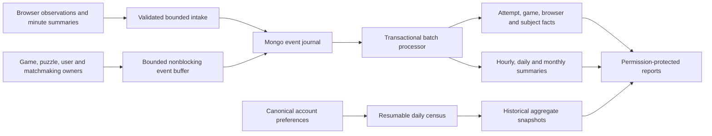

# Traffic Stats: implementation and operations

Traffic Stats lives at `/report/traffic`, linked from the report menu. `ViewTrafficStats` protects the page and every JSON/CSV endpoint; administrators have it initially. This is a separate product analytics subsystem, not a moderation report category.

## Retention and extensibility

All accepted analytics records are retained indefinitely. There are no TTL indexes, rolling event deletions, or age restrictions on hourly history. The schema migration rejects existing TTL indexes. Response budgets restrict the size of an individual query, not the lifetime of data. Account erasure remains an explicit privacy operation.

`TrafficCatalog` reads `BoardThemes`, `PieceSets`, `UiThemes`, `Backgrounds`, `SoundSets`, and `MusicSets` directly. Adding options to those owning catalogs automatically adds validation, usage collection, census counts, combinations, and report labels. Historical catalog labels are retained when an option is removed. Custom background URLs are represented by the `custom` category; the URLs are never collected.

## Reading the reports

The nine report areas cover overview, acquisition, pages, matchmaking, puzzles/learning, accounts, appearance, audio, and collection quality. Common controls select dates, UTC hour/day/week/month/year buckets, registered/anonymous audiences, a breakdown, a measurement, and a comparison with the preceding equal-length period. Clicking a category shows its timeline. Aggregate CSV export uses the same permission, filters, and query budgets and is logged.

- **Visitors** means observed browser identifiers, not verified humans or accounts. HLL sketches are unioned across time; daily unique estimates are never added. Confidence bounds accompany the visitor total. Clearing browser storage or using another device creates another browser identity. Sessions expire after 30 minutes without interaction; that expiration never deletes stored events.
- **Page usage** separates visible time from engagement. Engagement requires foreground visibility, ownership of attention by one browser tab, and interaction within two minutes. Board and puzzle-solving durations are separate measures. Device sleep gaps are discarded. Quick exits are observed visits shorter than ten visible seconds without meaningful activity; missing close events are not assumed to be exits.
- **Matchmaking** separates CTA exposure/click, room entry, search click, server acceptance, pairing, board readiness, first move, and game abortion. The cohort follows attempts accepted in the selected period even when their outcomes arrive later. Unresolved attempts remain unresolved. They are not silently called abandonments. Queue histograms provide approximate bucket-upper-bound percentiles; the cohort endpoint calculates exact percentiles from paired attempt timestamps. Pairing cohorts count player attempts, so two matched people represent two successful searches.
- **Puzzles and learning** distinguish presentation, first solving interaction, accepted result, reveal, review, next puzzle, lesson practice, and notation practice. The theme dimension is the chosen puzzle angle, not a claim that the player explicitly selected every theme attached to the puzzle. The current product does not provide arbitrary multi-theme selection. Appearance combinations are reported separately.
- **Accounts** has registration flow, cumulative observed registrations, a daily census, and mature signup return cohorts. Cumulative registration totals include the observed pre-period baseline for the unfiltered account chart. Backfill covers surviving account records; it cannot reconstruct deleted accounts. Return cohorts start at analytics installation and exclude follow-up days that have not fully elapsed. Activity predating collection is not interpreted as non-return. Small return cells are withheld.
- **Appearance** separates saved settings from observed board/foreground use. Board-piece pairs, theme-background pairs, and full six-component combinations are computed from event context. Switch episodes accumulate observed browser use across page loads. Board/piece episodes use engaged board time; other options use foreground engagement. The transition breakdown identifies the previous and next option. An ongoing selection, cleared storage, or another device is incomplete evidence rather than a completed episode. Do not infer that a rarely changed default is necessarily the best design.
- **Audio** distinguishes chosen track/effect set, enabled toggles, audible volume, and actual music playback. Enabled-time and playing-time percentages divide by engaged time. The current-state panel describes recently observed registered browsers (30 days), not all accounts. This reporting window does not expire underlying records. Saved account music choices are a different population from browser-local enabled toggles.
- **Geography** uses a local DB-IP Lite database. Network country/region/city is approximate; profile country is a self-selected flag. Unknown locations remain unknown. City cells with fewer than ten measured subjects are withheld. There are no arbitrary cross-filter intersections or individual-user exports.
- **Quality** shows processing freshness, oldest pending event, intake rejections, domain-buffer loss, geography availability, and sampled web-vitals. Performance observations use 10% of page loads and separate metric denominators. No claim is made that blocked browser observations represent all traffic.

For useful comparisons, examine high-volume pages first, compare similar populations and periods, inspect denominators, and confirm a problem with both engagement and outcome measures. Use style transitions alongside sustained usage and saved preference share before retiring an option. Compare pairing success and waits by time control before changing matchmaking defaults.

## Ownership and data flow



- `modules/core/src/main/traffic.scala` is the small domain publication contract. Owning modules publish successful outcomes without waiting for analytics storage. No analytics write is added per ordinary move; only the first-move milestone is observed.
- `ui/lib/src/traffic.ts` owns browser collection. It sends bounded batches and minute summaries, not mouse coordinates, keystroke contents, or per-move telemetry. The existing browser identifier is shared with presence through `browserId.ts`. A bounded per-tab outbox retries IDs across navigation and accepts only a durable intake acknowledgement as success. Unaccepted browser observations older than one day are discarded to bound retry state and clock skew; accepted server data never expires.
- `modules/traffic` owns schema validation, pseudonymous identities, catalogs, ingestion, projection, querying, account census, and erasure. A dedicated two-thread dispatcher isolates its CPU work. Geography uses a memory-mapped local database and a bounded transient cache; visitor IPs never leave the server for a geolocation request and are not written to the analytics database.
- `TrafficStore` writes an ordinary Mongo journal with unique event IDs. `$setOnInsert` makes partial delivery and retries idempotent. The processor handles at most 100 events per transaction and commits projection changes and processed flags together. A failed transaction leaves the original events available for retry. There is no fragile ObjectId/time watermark and no change-stream resume token to expire.
- Reports read indexed facts/summaries, never the raw journal. Interactive queries have two shared concurrency permits, three-second Mongo query deadlines, at most 500 chart buckets, and row limits that fail clearly rather than returning a partial population. Main reports use a short bounded cache. A single application instance owns the scheduled processor and maintenance loop in the current deployment; do not add replicas with independent maintenance workers without a distributed worker lease.
- `TrafficSnapshots` reads account/preference chunks of 200. It uses the canonical preference decoder, including defaults for missing preference documents. Cursor and counters commit together. Only completed census generations are published; each completed day remains stored. Historical registration backfill awaits journal persistence before advancing the census cursor.

The dedicated `lixiangqi_traffic` database contains `traffic_event`, `traffic_rollup`, `traffic_subject_day`, `traffic_attempt`, `traffic_game`, `traffic_subject`, `traffic_browser`, `traffic_snapshot`, `traffic_catalog`, `traffic_state`, `traffic_erasure`, and `traffic_rebuild`. Derived structures can be reconstructed from retained evidence; completed account censuses also preserve historical saved-state distributions.

## Failure, privacy, and recovery

The browser collector respects GPC, DNT, the `/privacy/traffic` preference, known crawler classification, and administrator exclusion by default. A public privacy-navigation link exposes the preference. Operational domain events and aggregate account censuses remain separate from optional browser observations, as explained on that page.

Browser ingestion acknowledges journal persistence. Domain publication uses a bounded 4,096-event buffer outside game/matchmaking response dependencies; its loss counter is visible. A process crash can lose unpublished domain observations. This is product measurement, not an audit ledger. Registrations and preference populations are reconciled by the resumable census; historical repeated puzzle attempts and lost queue outcomes cannot reliably be reconstructed.

Account deletion first records a durable HMAC subject tombstone. Intake excludes tombstoned subjects. Bounded maintenance removes their linkable journal/facts and rebuilds affected months from retained surviving events. Reports are unavailable during rebuilding to avoid returning stale sketches. Both ordinary processing and erasure continue when new collection is disabled. The identity key is checked against the database before processing; an accidental key change fails clearly instead of creating duplicate populations or losing erasure linkage.

Preserve `LIXIANGQI_TRAFFIC_IDENTITY_KEY` with database backups. It defaults to the existing stable Play secret when not separately configured. Changing either secret requires a planned identity migration, not a normal rotation of this analytics key.

Before restoring an older analytics backup, preserve the current `traffic_erasure` collection and the identity key. With application writers stopped, restore the backup, merge every retained tombstone back with `complete:false`, then let maintenance finish before exposing reports or enabling intake. Do not resume an old backup without current tombstones: doing so could resurrect erased data. Routine deployment rollback already restricts database restoration to the period before writers resume.

## Deployment

`tools/data_migration/20260924_traffic_stats_v1.js` is additive and idempotent. It requires a replica-set primary, creates collections/indexes, rejects TTL indexes, and records schema version 1 and indefinite retention. It does not rewrite games, accounts, or preferences.

The adjacent `lixiangqi-beta-deployment` workspace packages and verifies that migration, executes it against the dedicated database while writers are stopped, and configures the analytics URI/key. Its existing full Mongo backup includes analytics. GeoIP preparation runs locally during release packaging via `python -m tools.traffic.geoip`; the prepared MMDB and checksum metadata are verified and bundled. [DB-IP Lite](https://db-ip.com/db/download/ip-to-city-lite) is updated monthly and requires attribution, supplied in the report. Redeploy to refresh the file; page requests never download it.

The Windows preview launcher initializes a local single-node replica set and runs the same migration against `lixiangqi_traffic_preview`. This database is isolated from production and from the main preview database. An unrelated Mongo process must never be stopped automatically.

Production visitor addresses depend on the HTTP proxy trust boundary. The deployment includes `conf/http-proxy.conf`, gives Caddy the fixed address `172.30.73.2` on a dedicated internal `/29` network, and routes web requests through the `lila-http` alias on that network. Play trusts only that proxy, using [Caddy's sanitized forwarded headers](https://caddyserver.com/docs/caddyfile/directives/reverse_proxy#headers) for both IPv4/IPv6 visitor addresses and the original HTTPS scheme. The ordinary default Docker network is not trusted. `push-local-live` packages the configuration and recreates the application containers, so the fix needs no database migration or manual server step. Local previews retain Play's default proxy policy; loopback/private visitor addresses have no geographic location.

Before this proxy configuration was added, Play treated Caddy's private Docker address as the visitor, producing `unknown` geography despite a healthy MMDB reader. Previously accepted unknown events cannot be reliably geolocated retroactively: raw visitor IP addresses were deliberately never stored. They remain intact, and corrected geography starts with new observations after deployment.

Indefinite retention means storage growth is ongoing. At an illustrative 150,000 records/day and 500 bytes/record, the raw journal alone grows about 27 GB/year before indexes, projections, and backup copies. Actual BSON size, cardinality, write amplification, peak load, and WiredTiger cache pressure must be measured on the deployed workload. Provision and monitor disk/backup capacity; never solve pressure with an age-based deletion job. Collection can be disabled with `LIXIANGQI_TRAFFIC_ENABLED=false` while preserving stored records and maintenance.

## Verification

The backend tests exercise validation, catalog-derived choices, HLL union, UTC calendar boundaries, old hourly queries, duplicate delivery, transaction rollback, concurrent processors, late queue outcomes, erasure/rebuild across restarts, and full-context attention batches against a disposable real Mongo replica set. Set `LIXIANGQI_TRAFFIC_TEST_URI` to a dedicated local test server to run the integration suite; it creates and removes only uniquely named `traffic_test_*` databases.

`HttpProxyTest` exercises Play's actual forwarded-header handler with the production proxy configuration, including IPv6, HTTPS, untrusted peers, and forged earlier forwarding hops. Set `LIXIANGQI_TRAFFIC_GEOIP_TEST_FILE` to the absolute path of the prepared DB-IP MMDB to also verify real location lookups through that handler.

Browser unit tests cover hidden tabs, idle/sleep boundaries, attention ownership, calendar gaps, ratios, and selection episodes with newly introduced catalog options. Frontend builds, repository lint/format checks, Scala tests/staging, deployment safety tests, and responsive report verification are required before release. Local results do not establish production latency or completeness of historical data.

Run the retained browser integration checks from the repository root after installing dependencies and building assets:

```powershell
node tools/traffic/tests/collector.mjs
node tools/traffic/tests/report.mjs
```

They use isolated Playwright fixtures, never a production session. The report check exercises every tab at 1440, 900, and 390 pixels and both light/dark themes, checks browser exceptions and horizontal overflow, and writes screenshots below `.tools/`. The collector check exercises real browser timers, batched transport, a failed request followed by navigation/retry, dynamically named appearance options, selection durations, and GPC. Its standalone minified collector measured about 4.6 KB gzipped; web-vitals is a separate sampled import. A representative 100-event Mongo batch completed in about 0.7 seconds for 100 distinct synthetic accounts/cities during the local full test run; this is a smoke measurement, not a production capacity guarantee.
